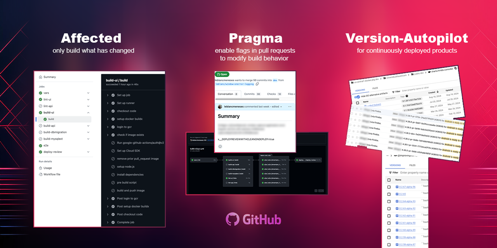

- [Actions](#actions)
  - [Affected Action](#affected-action)
    - [Key Features](#key-features)
    - [Recommendations:](#recommendations)
    - [Rule DSL](#rule-dsl)
      - [Composing Rules](#composing-rules)
      - [Literal Expression](#literal-expression)
      - [Regex Expression](#regex-expression)
      - [Suffix for Literal and Regex Expressions](#suffix-for-literal-and-regex-expressions)
        - [Usage with Literal Expressions:](#usage-with-literal-expressions)
        - [Usage with Regular Expressions:](#usage-with-regular-expressions)
        - [Key Notes:](#key-notes)
      - [Negate Expression](#negate-expression)
      - [Except Expression](#except-expression)
      - [Wrapping up example](#wrapping-up-example)
    - [Consuming the JSON object](#consuming-the-json-object)
    - [Real world usage](#real-world-usage)
  - [Pragma Action](#pragma-action)
    - [Features](#features)
    - [Inputs](#inputs)
    - [Outputs](#outputs)
    - [Pull Request Override Usage](#pull-request-override-usage)
    - [Merged Result](#merged-result)
    - [Consuming the JSON object](#consuming-the-json-object-1)
  - [Version Autopilot Action](#version-autopilot-action)
    - [Real world usage](#real-world-usage-1)
- [Recommendations for multi-job pipeline](#recommendations-for-multi-job-pipeline)
- [Run locally](#run-locally)
- [Contributing](#contributing)
- [Need Help?](#need-help)
- [License](#license)

# Actions

## Affected Action

This task is designed for projects in mono repos that are not *fully* covered by build tools like Make, Bazel, or Nx. It helps track the dependency graph and streamline your pipeline by identifying and executing only the steps impacted by recent changes.

### Key Features

* **Dependency Graph Optimization:** Generates a JSON object to identify dependencies impacted by `changes`, allowing you to skip unnecessary steps and focus only on what needs to be executed.
* **Commit Alignment:** Aligns Git commits with images using `recommended_imagetags` and `shas`. These hashes represent the state of the dependency graph, based on defined rules, ensuring consistency across your workflow.

### Recommendations:

* Use `changes` for pull requests to detect and act upon specific updates.
* Use `shas` for core branches like `main`, `develop`, and `prod` as a key for caching purposes, improving build efficiency.

This approach helps optimize pipelines, reduce execution time, and maintain reliable caching across your development workflow.

```yaml
jobs:
  init:
    runs-on: ubuntu-latest
    steps:
      - name: Checkout code
        uses: actions/checkout@v4
        with:
          fetch-depth: 0 # fetch all history for accurate change detection
          # If you have multi-job workflow add affected task to an init step to avoid redundant checkouts.
          # If you are using path triggers the diff is limited to 300 files.
          # @see: https://docs.github.com/en/actions/writing-workflows/workflow-syntax-for-github-actions#git-diff-comparisons
          # With this task you can get all the changes.

      - name: calculate affected
        id: affected
        uses: leblancmeneses/actions/dist/apps/affected@main
        with:
          verbose: false # optional
          gitflow-production-branch: '' # optional; used in recommended_imagetags.
          recommended-imagetags-prefix: '' # optional; used in recommended_imagetags.
          rules: |
            peggy-parser: 'apps/affected/src/parser.peggy';
            peggy-parser-checkIf-incomplete: peggy-parser AND (!'apps/affected/src/parser.ts' OR !'apps/e2e/src/affected/parser.spec.ts');
              # peggy was updated but not the generated parser file or its tests.

            markdown: '**/*.md';

            ui-core: 'libs/ui-core/**';
            third-party-deprecated: 'libs/third-party-deprecated/**';
            ui-libs: ui-core third-party-deprecated;

            <project-ui>: ui-libs 'project-ui/**' EXCEPT (markdown '**/*.spec.ts');
            <project-api>: 'project-api/**' EXCEPT ('**/README.md');
            <project-dbmigrations>: './databases/project/**';

            project-e2e: ('e2e/**' project-ui project-api project-dbmigrations) EXCEPT (markdown);

```
### Rule DSL

These rules map a *project name* and the *expression* to check for changes and to generate an sha1 hash of the dependency graph.

* The left side of the colon `:` is the **rule key**, while the right side specifies the **expression** to match files.
* **Rule keys with brackets** `<>` will appear in the JSON object under `recommended_imagetags` or `shas`, and `changes`.
* **Rule keys without brackets** will only appear in `changes` but **not** in `recommended_imagetags` or `shas`.
* Glob expressions use [picomatch](https://github.com/micromatch/picomatch) for matching.


#### Composing Rules

The `project-e2e` rule is composed of `project-ui`, `project-api`, and `project-dbmigrations`, enabling you to reference and combine multiple expressions. For example, `e2e` runs when files change in any of these projects but excludes runs triggered by markdown-only changes.

Expressions can combine multiple conditions using `AND` or `OR` operators. If no operator is specified, `OR` is used by default.

#### Literal Expression

Literal expressions are string-based and can be enclosed in single or double quotes. For example:

* `'file.ts'` OR `"file.ts"`

By default, literal expressions are case-sensitive. To make them case-insensitive, append the `i` flag:

* Example: `"readme.md"i` will match `README.md`, `readme.md`, or `rEaDme.mD`.

#### Regex Expression

Regex expressions allow for more flexible matching and are defined using the standard JavaScript regex syntax. For example:

* `/readme\.md/i`

This regex will match `README.md`, `readme.md`, or `rEaDme.mD`. Internally, the expression is converted to a JavaScript RegExp object, ensuring full compatibility with JavaScript’s native regex functionality.


#### Suffix for Literal and Regex Expressions

By default, all expressions match files regardless of their Git status code. However, you can add a suffix to the expression to filter matches based on specific Git status codes.
The suffixes are `A` for added, `M` for modified, `D` for deleted, `R` for renamed, `C` for copied, `U` for unmerged, `T` for typechange, `X` for unknown, `B` for broken.

##### Usage with Literal Expressions:
* **Default behavior:** `'file.ts'` matches files with any Git status code.
* **With status suffix:** `'file.ts':M` matches only files with the "modified" status.
* **Case-insensitive matching:** `'file.ts'i:A` matches "added" files, ignoring case.

##### Usage with Regular Expressions:
* **Default behavior:** `/readme\.md/` matches files with any Git status code.
* **With status suffix:** `/readme\.md/:M` matches only "modified" files.
* **Case-insensitive matching:** `/readme\.md/i:A` matches "added" files, ignoring case.

##### Key Notes:
1. **Suffix Syntax:** Add a colon : followed by the desired status code to filter matches.
2. **Case Insensitivity:** Use the i flag before the colon to make the match case-insensitive.


#### Negate Expression

The `!` operator is used to exclude specific files or directories from matching criteria. This ensures that certain files or directories are not modified in a pull request.

* **Example:** `!'dir/file.js'` ensures that changes to `dir/file.js` are not allowed in a pull request.


#### Except Expression

The `EXCEPT` operator removes files or directories from the expression.

```yaml
  markdown: '**/*.md';
  <project-ui>: 'project-ui/**' EXCEPT (markdown '**/*.spec.ts');
```


#### Wrapping up example

Assuming a changelist contains the following files:

```json
[
  "project-ui/file1.js",
  "project-api/README.md",
]
```

The `affected` action will generate the following JSON objects:

```json
{
  "changes": {
    "peggy-parser": false,
    "peggy-parser-checkIf-incomplete": false,
    "markdown": true,
    "project-api": false,
    "project-ui": true,
    "project-dbmigrations": false,
    "project-e2e": true,
    "third-party-deprecated": false,
    "ui-core": false,
    "ui-libs": false
  },
  "shas": {
    "project-ui": "38aabc2d6ae9866f3c1d601cba956bb935c02cf5",
    "project-api": "dd65064e5d3e4b0a21b867fa02561e37b2cf7f01",
    "project-dbmigrations": "7b367954a3ca29a02e2b570112d85718e56429c9"
  },
  "recommended_imagetags": {
    "project-ui": [
      "project-ui:dev-38aabc2d6ae9866f3c1d601cba956bb935c02cf5",
      "project-ui:pr-6"
    ],
    "project-api": [
      "project-api:dev-dd65064e5d3e4b0a21b867fa02561e37b2cf7f01",
      "project-api:pr-6"
    ],
    "project-dbmigrations": [
      "project-dbmigrations:dev-7b367954a3ca29a02e2b570112d85718e56429c9",
      "project-dbmigrations:pr-6"
    ],
  }
}
```

### Consuming the JSON object

```yaml
      - name: example affected output
        run: |
          echo "affected: "
          echo '${{ steps.affected.outputs.affected }}' | jq .

          # You can use env values for naming complex expressions.
          HAS_CHANGED_PROJECT_E2E=$(echo '${{ steps.affected.outputs.affected }}' | jq -r '.changes["project-e2e"]')
          echo "HAS_CHANGED_PROJECT_E2E=$HAS_CHANGED_PROJECT_E2E" >> $GITHUB_ENV

      - name: e2e tests
        if: ${{ !failure() && !cancelled() && fromJson(steps.affected.outputs.affected).changes.project-e2e }}
        run: npx nx run e2e:e2e
```

### Real world usage

```yaml

jobs:
  vars:
    uses: ./.github/workflows/template.job.init.yml
    secrets:
      GCP_GITHUB_SERVICE_ACCOUNT: ${{secrets.GCP_GITHUB_SERVICE_ACCOUNT}}

  build-ui:
    needs: [vars, lint-ui, lint-api]
    uses: ./.github/workflows/template.job.build.yml
    if: |
      !failure() && !cancelled() && needs.lint-ui.result != 'failure'
    with:
      ENABLED: ${{fromJson(needs.vars.outputs.affected).changes.app-ui}}
      FORCE_BUILD: ${{ github.event.inputs.MANUAL_FORCE_BUILD == 'true' ||
        fromJson(needs.vars.outputs.pragma).FORCE-BUILD == true }}
      PRE_BUILD_HOOK: .github/_prebuild.app-ui.sh
      DOCKER_FILE: "./app-ui/Dockerfile"
      DOCKER_CONTEXT: "./app-api"
      DOCKER_BUILD_ARGS: "ENV_TYPE=production"
      DOCKER_LABELS: ${{needs.vars.outputs.IMAGE_LABELS}}
      DOCKER_IMAGE_TAGS: ${{ fromJson(needs.vars.outputs.affected).recommended_imagetags.app-ui &&
           toJson(fromJson(needs.vars.outputs.affected).recommended_imagetags.app-ui) || '[]' }}
      CHECKOUT_REF: ${{needs.vars.outputs.CHECKOUT_REF}}
    secrets:
      GCP_GITHUB_SERVICE_ACCOUNT: ${{secrets.GCP_GITHUB_SERVICE_ACCOUNT}}

  # ...
```

<br>
<br>
<br>
<br>

## Pragma Action

This GitHub Action allows pull requests to change behavior allowing builds to accept `[skip,deploy,force]` flags.

### Features
- **Pull Request Overrides**: Extracts variables from pull request descriptions using a specific pattern (`x__key=value`).
- **Key Standardization**: Ensures all keys are converted to uppercase to avoid case-sensitivity issues.
- **Merged Configuration**: Combines default variables with overrides, giving precedence to pull request variables.
- **Flexible Value Types**: Automatically converts values to appropriate types (`boolean`, `number`, or `string`).

### Inputs

| Name       | Required | Description                                                  |
|------------|----------|--------------------------------------------------------------|
| `variables`| Yes      | A string containing INI-formatted variables as default values. |

### Outputs

| Name    | Description                                      |
|---------|--------------------------------------------------|
| `pragma`| A JSON object containing the merged configuration variables. |

### Pull Request Override Usage

Developers can override default variables by adding variables prefixed with `x__` to the pull request description.
These variables will take precedence over the defaults specified in the variables input. For example:

```yaml
      - name: calculate pragma
        id: pragma
        uses: leblancmeneses/actions/dist/apps/pragma@main
        with:
          variables: | # INI format to initialize default variables
            lint-appname-ui = ''
            force = false
            deploy = "${{ github.ref == 'refs/heads/dev' || github.ref == 'refs/heads/prod' }}"

```

Pull request description:

```
PR description

...

x__lint-appname-ui=skip
```

### Merged Result

The final merged output for this example would be:

```json
{
  "LINT-APPNAME-UI": "skip",
  "FORCE": false,
  "DEPLOY": false
}
```

### Consuming the JSON object

This will override the `LINT-APPNAME-UI` variable to skip the linting step.

```yaml
      - name: lint appname-ui
        if: ${{ !failure() && !cancelled() && fromJson(steps.pragma.outputs.pragma).LINT-APPNAME-UI != 'skip' }}
        run: npm run lint:appname-ui
```


<br>
<br>
<br>
<br>

## Version Autopilot Action

This is perfect for packages that are not meant to be **consumed** by other packages, like a website or a mobile app,
where semantic versioning is not required and is continuously deployed.

This will automatically increment the version on every **run** of your github action pipeline.


```yaml
  - name: calculate version autopilot
    id: version-autopilot
    uses: leblancmeneses/actions/dist/apps/version-autopilot@main
    with:
      major: 0
      minor: 0
      shift: 50 # remove if this is a brand new application. Otherwise, use this to match your current version.

  - name: example in README.md output
    run: |
      echo "github.run_number: ${{ github.run_number }}"

      # useful for container image and package names
      echo "version_autopilot_string_recommended: ${{ steps.version-autopilot.outputs.version_autopilot_string_recommended }}"

      # base to derive your own versioning naming scheme
      echo "version_autopilot_string: ${{ steps.version-autopilot.outputs.version_autopilot_string }}"

      # android and ios version codes
      echo "version_autopilot_code: ${{ steps.version-autopilot.outputs.version_autopilot_code }}"

      # json object with all fields
      echo '${{ steps.version-autopilot.outputs.version_autopilot }}' | jq .

```


If you have an existing application you can modify the `major`.`minor` and `shift` inputs to match the current version of your application.
See our [.github/workflows/tests.version-autopilot.yml](.github/workflows/tests.version-autopilot.yml) for how rollover works. We leverage `${{github.run_number}}` internally to increment the version.

If you are looking for semantic versioning research `git tags` and [release pipelines](https://docs.github.com/en/repositories/releasing-projects-on-github/managing-releases-in-a-repository).


### Real world usage

1. For Docker image tagging

```yaml
  - name: myapp containerize and push
    uses: docker/build-push-action@v5
    with:
      platforms: linux/amd64
      push: true
      tags: ${{ env.ARTIFACT_REGISTRY }}/myapp:${{ steps.version-autopilot.outputs.version_autopilot_string_recommended }}
      context: ./apps/myapp
      file: ./apps/myapp/Dockerfile-myapp
```

2. For Android APK generation:

```yaml
  - name: apk generation for PR
    if: github.event_name == 'pull_request'
    run: bash ./gradlew assembleDebug --stacktrace
    env:
      APP_VERSION_CODE: ${{ steps.version-autopilot.outputs.version_autopilot_code }}
      APP_VERSION_STRING: ${{ steps.version-autopilot.outputs.version_autopilot_string_recommended }}
      BASE_URL: https://xyz-${{github.event.number}}-api.<project>.nobackend.io/
```

3. For IOS IPA build

```yaml

  - name: archive and export IPA
    run: |
      xcodebuild \
        -workspace MyApp.xcworkspace \
        -scheme MyApp \
        -configuration Release \
        -destination 'generic/platform=iOS' \
        CURRENT_PROJECT_VERSION=${{ steps.version-autopilot.outputs.version_autopilot_code }} \
        MARKETING_VERSION=${{ steps.version-autopilot.outputs.version_autopilot_string }} \
        PROVISIONING_PROFILE_SPECIFIER=${{ github.ref_name == 'prod' && 'distribution-profile' || 'adhoc-profile' }} \
        -archivePath ./build/MyApp.xcarchive \
        archive | xcpretty --simple --color
      ....
```

4. For a chrome extension:

```yaml
  - name: update manifest version
    run: |
      manifest=tabsift/extension/manifest.json
      jq --arg version "${{ steps.version-autopilot.outputs.version_autopilot_string }}" '.version = $version' $manifest > tmp.json && mv tmp.json $manifest
```

# Recommendations for multi-job pipeline

Create an init job to calculate variables needed across multiple jobs. This will avoid redundant checkouts and calculations across each job.

Generate an init.yml file with the following content:

```yaml
name: template.job.init

on:
  workflow_call:
    outputs:
      affected:
        value: ${{ jobs.init.outputs.affected }}
      pragma:
        value: ${{ jobs.init.outputs.pragma }}
      version-autopilot:
        value: ${{ jobs.init.outputs.version-autopilot }}

jobs:
  init:
    runs-on: ubuntu-latest
    outputs:
      affected: ${{steps.affected.outputs.affected}}
      pragma: ${{steps.pragma.outputs.pragma}}
      version-autopilot: ${{steps.version-autopilot.outputs.version_autopilot}}
    steps:
      - name: Checkout code
        uses: actions/checkout@v4
        with:
          fetch-depth: 0

      - name: calculate pragma outputs
        id: pragma
        uses: leblancmeneses/actions/dist/apps/pragma@main
        with:
          variables: |
            ...

      - name: calculate affected outputs
        id: affected
        uses: leblancmeneses/actions/dist/apps/affected@main
        with:
          rules: |
            ...

      - name: calculate version-autopilot outputs
        id: version-autopilot
        uses: leblancmeneses/actions/dist/apps/version-autopilot@main
        with:
          major: 0
          minor: 0
          shift: 0

      # Add more steps or calculations here to validate run.
      # ...

```

```yaml
name: build-app-name

on:
  push:
    # ...
  pull_request:
    # ...
  workflow_dispatch:
    # ...

jobs:
  vars:
    uses: ./.github/workflows/template.job.init.yml

  example:
    needs: [vars]
    runs-on: ubuntu-latest
    steps:
      - name: example output
        run: |
          echo "affected: "
          echo '${{ needs.vars.outputs.affected }}' | jq .
          echo "pragma: "
          echo '${{ needs.vars.outputs.pragma }}' | jq .
          echo "version-autopilot: "
          echo '${{ needs.vars.outputs.version-autopilot }}' | jq .
```

We recommend locking the `uses:` clause to a specific tag or sha to avoid pipeline
breakage due to future changes in the action.

```yaml
uses: leblancmeneses/actions/dist/apps/<taskname>@main # latest
uses: leblancmeneses/actions/dist/apps/<taskname>@v1.1.1 # specific tag
uses: leblancmeneses/actions/dist/apps/<taskname>@commit-sha # specific sha
```

# Run locally

```bash
nvm use
pnpm i
npx nx run e2e:e2e
```

# Contributing
Contributions are welcome! Please open an issue or submit a pull request if you have suggestions or improvements.


# Need Help?

Large language models (LLMs) cannot solve your organization's people problems. If your software teams are struggling and falling behind, consider engaging an actual human expert who can identify product and development issues and provide solutions.

Common areas where we can assist include DSL development, continuous delivery, cloud migrations, Kubernetes cluster cost optimizations, GitHub Actions and GitHub Codespaces.

Contact us at [improvingstartups.com](https://improvingstartups.com).


# License
This project is licensed under the [MIT License](LICENSE).