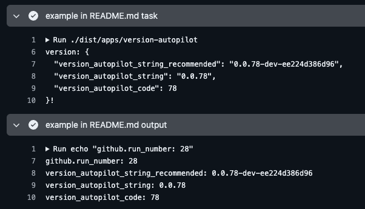

- [Actions](#actions)
  - [Affected](#affected)
    - [Rule DSL](#rule-dsl)
      - [Rule Key Examples](#rule-key-examples)
      - [Composing Rules](#composing-rules)
      - [Exclusion Expression](#exclusion-expression)
      - [Wrapping up example](#wrapping-up-example)
    - [Consuming the JSON object](#consuming-the-json-object)
  - [Pragma Action](#pragma-action)
    - [Features](#features)
    - [Inputs](#inputs)
    - [Outputs](#outputs)
    - [Pull Request Override Usage](#pull-request-override-usage)
    - [Merged Result](#merged-result)
    - [Consuming the JSON object](#consuming-the-json-object-1)
  - [Version Autopilot](#version-autopilot)
    - [Example usages](#example-usages)
  - [Run locally:](#run-locally)
  - [Contributing](#contributing)
  - [License](#license)
  - [Need Help?](#need-help)

# Actions

## Affected

This task generates 3 JSON objects to streamline your pipeline by skipping unnecessary steps and running only those affected by `changes`. It also aligns git commits with images via `recommended_imagetags` and `shas`, simplifying GitOps strategies.


```yaml
jobs:
  init:
    runs-on: ubuntu-latest
    steps:
      - name: Checkout code
        uses: actions/checkout@v4
        with:
          fetch-depth: 0 # fetch all history for accurate change detection
          # if you have multi-job workflow add affected task to an init step to avoid redundant checkouts.

      - name: calculate affected
        id: affected
        uses: leblancmeneses/actions/dist/apps/affected@main
        with:
          rules: |
            <project-ui>: 'project-ui/**';
            <project-api>: 'project-api/**';
            [project-dbmigrations](./databases/project): './databases/project/**';
            project-e2e: project-ui project-api project-dbmigrations !'**/*.md';

```
### Rule DSL

These rules map a *project name*, its *directory*, and the *expression* to check for changes.

* The left side of the colon `:` is the **rule key**, while the right side specifies the expression to match files.
* **Rule keys with brackets** `[]` or `<>` will appear in the JSON object under `recommended_imagetags` or `shas`, and `changes`.
* **Rule keys without brackets** will only appear in `changes` but **not** in `recommended_imagetags` or `shas`.

#### Rule Key Examples

1. **Short Form**: `<project-ui>` The image name is `project-ui`, and the project directory is `project-ui`.
2. **Long Form**: `[project-dbmigrations](./databases/project)` The image name is `project-dbmigrations`, and the project directory is `./databases/project`.

#### Composing Rules

The `project-e2e` rule includes `project-ui`, `project-api`, and `project-dbmigrations`. This allows referencing prior expressions and combining them using `OR` operator.
For example, **e2e** runs if files change in any of these projects but not for markdown-only changes.

#### Exclusion Expression

The `!` operator excludes files or directories.

* For example, `**/*.md` excludes all markdown files.
* Glob expressions use [picomatch](https://github.com/micromatch/picomatch) for matching.

This structure provides flexibility and reusability for defining change-based rules across projects.

#### Wrapping up example

Assuming a change list containing:

```json
[
  "project-ui/file1.js",
  "project-api/readme.md",
]
```

The `affected` action will generate the following JSON objects:

```json
{
  "changes": {
    "project-api": true,
    "project-ui": true,
    "project-dbmigrations": false,
    "project-e2e": true
  },
  "shas": {
    "project-ui": "38aabc2d6ae9866f3c1d601cba956bb935c02cf5",
    "project-api": "dd65064e5d3e4b0a21b867fa02561e37b2cf7f01",
    "project-dbmigrations": "7b367954a3ca29a02e2b570112d85718e56429c9"
  },
  "recommended_imagetags": {
    "project-ui": [
      "project-ui:dev-38aabc2d6ae9866f3c1d601cba956bb935c02cf5",
      "project-ui:pr-6"
    ],
    "project-api": [
      "project-api:dev-dd65064e5d3e4b0a21b867fa02561e37b2cf7f01",
      "project-api:pr-6"
    ],
    "project-dbmigrations": [
      "project-dbmigrations:dev-7b367954a3ca29a02e2b570112d85718e56429c9",
      "project-dbmigrations:pr-6"
    ],
  }
}
```

### Consuming the JSON object

```yaml
      - name: example affected output
        run: |
          echo "affected: "
          echo '${{ steps.affected.outputs.affected }}' | jq .

          # You can use env values for naming complex expressions.
          AFFECTED_AFFECTED=$(echo '${{ steps.affected.outputs.affected }}' | jq -r .changes.affected)
          VERSION_AUTOPILOT_AFFECTED=$(echo '${{ steps.affected.outputs.affected }}' | jq -r '.changes["version-autopilot"]')

          echo "AFFECTED_AFFECTED=$AFFECTED_AFFECTED" >> $GITHUB_ENV
          echo "VERSION_AUTOPILOT_AFFECTED=$VERSION_AUTOPILOT_AFFECTED" >> $GITHUB_ENV

      - name: e2e tests
        if: ${{ fromJson(steps.affected.outputs.affected).changes.project-e2e }}
        run: npx nx run e2e:e2e
```

## Pragma Action

This GitHub Action allows pull requests to change behavior allowing builds to accept `[skip,deploy,force]` flags.

### Features
- **Pull Request Overrides**: Extracts variables from pull request descriptions using a specific pattern (`x__key=value`).
- **Key Standardization**: Ensures all keys are converted to uppercase to avoid case-sensitivity issues.
- **Merged Configuration**: Combines default variables with overrides, giving precedence to pull request variables.
- **Flexible Value Types**: Automatically converts values to appropriate types (`boolean`, `number`, or `string`).

### Inputs

| Name       | Required | Description                                                  |
|------------|----------|--------------------------------------------------------------|
| `variables`| Yes      | A string containing INI-formatted variables as default values. |

### Outputs

| Name    | Description                                      |
|---------|--------------------------------------------------|
| `pragma`| A JSON object containing the merged configuration variables. |

### Pull Request Override Usage

Developers can override default variables by adding variables prefixed with `x__` to the pull request description.
These variables will take precedence over the defaults specified in the variables input. For example:

```yaml
      - name: Run Pragma Action
        id: pragma
        uses: leblancmeneses/actions/dist/apps/pragma@main
        with:
          variables: | # INI format to initialize default variables
            lint-appname-ui = ''
            force = false
            deploy = "${{ github.ref == 'refs/heads/dev' || github.ref == 'refs/heads/prod' }}"

```

Pull request description:

```
PR description

...

x__lint-appname-ui=skip
```

### Merged Result

The final merged output for this example would be:

```json
{
  "LINT-APPNAME-UI": "skip",
  "FORCE": false,
  "DEPLOY": false
}
```

### Consuming the JSON object

This will override the `LINT-APPNAME-UI` variable to skip the linting step.

```yaml
      - name: lint appname-ui
        if: ${{ fromJson(steps.pragma.outputs.pragma).LINT-APPNAME-UI != 'skip' }}
        run: npm run lint:appname-ui
```


## Version Autopilot

This is perfect for packages that are not meant to be **consumed** by other packages, like a website or a mobile app,
where semantic versioning is not required and is continuously deployed.

This will automatically increment the version on every **run** of your github action pipeline.


```yaml
  - name: calculate version autopilot
    id: version-autopilot
    uses: leblancmeneses/actions/dist/apps/version-autopilot@main
    with:
      major: 0
      minor: 0
      shift: 50 # remove if this is a brand new application. Otherwise, use this to match your current version.

  - name: example in README.md output
    run: |
      echo "github.run_number: ${{ github.run_number }}"

      # useful for container image and package names
      echo "version_autopilot_string_recommended: ${{ steps.version-autopilot.outputs.version_autopilot_string_recommended }}"

      # base to derive your own versioning naming scheme
      echo "version_autopilot_string: ${{ steps.version-autopilot.outputs.version_autopilot_string }}"

      # android and ios version codes
      echo "version_autopilot_code: ${{ steps.version-autopilot.outputs.version_autopilot_code }}"
```



If you have an existing application you can modify the `major`.`minor` and `shift` inputs to match the current version of your application.
See our [.github/workflows/tests.version-autopilot.yml](.github/workflows/tests.version-autopilot.yml) for how rollover works. We leverage `${{github.run_number}}` internally to increment the version.

If you are looking for semantic versioning research `git tags` and [release pipelines](https://docs.github.com/en/repositories/releasing-projects-on-github/managing-releases-in-a-repository).


### Example usages

1. For Docker image tagging

```yaml
  - name: myapp containerize and push
    uses: docker/build-push-action@v5
    with:
      platforms: linux/amd64
      push: true
      tags: ${{ env.ARTIFACT_REGISTRY }}/myapp:${{ steps.version-autopilot.outputs.version_autopilot_string_recommended }}
      context: ./apps/myapp
      file: ./apps/myapp/Dockerfile-myapp
```

2. For Android APK generation:

```yaml
  - name: apk generation for PR
    if: github.event_name == 'pull_request'
    run: bash ./gradlew assembleDebug --stacktrace
    env:
      APP_VERSION_CODE: ${{ steps.version-autopilot.outputs.version_autopilot_code }}
      APP_VERSION_STRING: ${{ steps.version-autopilot.outputs.version_autopilot_string_recommended }}
      BASE_URL: https://xyz-${{github.event.number}}-api.<project>.nobackend.io/
```

3. For IOS IPA build

```yaml

  - name: archive and export IPA
    run: |
      xcodebuild \
        -workspace MyApp.xcworkspace \
        -scheme MyApp \
        -configuration Release \
        -destination 'generic/platform=iOS' \
        CURRENT_PROJECT_VERSION=${{ steps.version-autopilot.outputs.version_autopilot_code }} \
        MARKETING_VERSION=${{ steps.version-autopilot.outputs.version_autopilot_string }} \
        PROVISIONING_PROFILE_SPECIFIER=${{ github.ref_name == 'prod' && 'distribution-profile' || 'adhoc-profile' }} \
        -archivePath ./build/MyApp.xcarchive \
        archive | xcpretty --simple --color
      ....
```

4. For a chrome extension:

```yaml
  - name: update manifest version
    run: |
      manifest=tabsift/extension/manifest.json
      jq --arg version "${{ steps.version-autopilot.outputs.version_autopilot_string }}" '.version = $version' $manifest > tmp.json && mv tmp.json $manifest
```

## Run locally:

```bash
nvm use
pnpm i
npx nx run e2e:e2e
```

## Contributing
Contributions are welcome! Please open an issue or submit a pull request if you have suggestions or improvements.


## License
This project is licensed under the [MIT License](LICENSE).


## Need Help?

Large language models (LLMs) cannot solve your organization's people problems. If your software teams are struggling and falling behind, consider engaging an actual human expert who can identify product and development issues and provide solutions.

Common areas where we can assist include DSL development, continuous delivery, cloud migrations, Kubernetes cluster cost optimizations, GitHub Actions and GitHub Codespaces.

Contact us at [improvingstartups.com](https://improvingstartups.com).